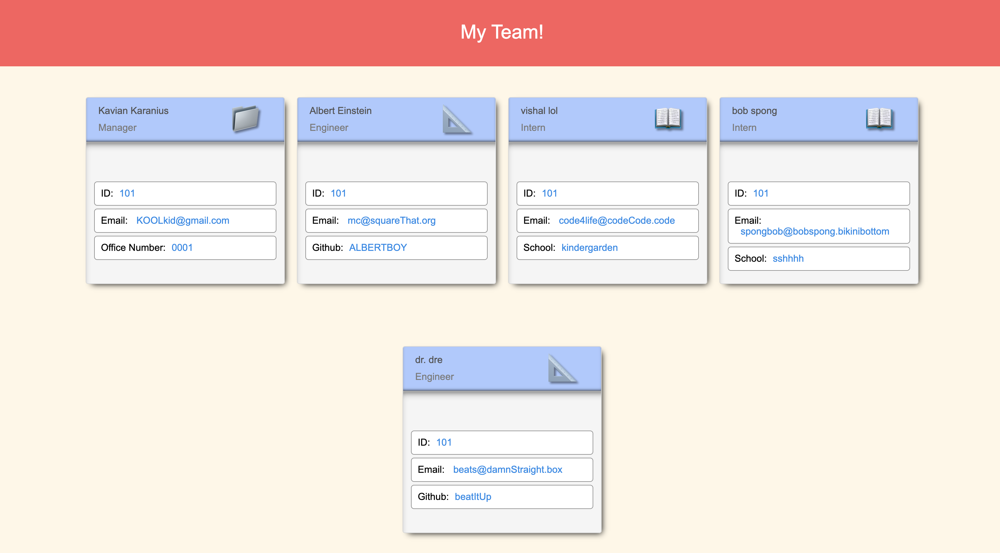

# UofT Full-Stack Web Development Bootcamp Project #8: Template Engine - Team Generator

A software engineering team generator command line application

## Table of Contents

1. [About](#about)
1. [Business Context](#business-context)
1. [Minimum Requirements](#minimum-requirements)
1. [Classes](#classes)
1. [User Input](#user-input)
1. [Roster Output](#roster-output)
1. [Submission](#submission)
1. [Development Strategy](#development-strategy)
1. [Built With](#built-with)
1. [Demo](#demo)
1. [Getting Started](#getting-started)



## About

Employee Summary application prompts the user for information about the team manager and then information about the team members. As a user, you can input any number of team members, and they may be a mix of engineers and interns. Once all the team members are logged, the application will create an HTML file that displays a nicely formatted team roster based on the information provided by the user.

## Business Context

```
As a manager
I want to generate a webpage that displays my team's basic info
so that I have quick access to emails and GitHub profiles
```

## Minimum Requirements

* Functional application.

* GitHub repository with a unique name and a README describing the project.

* User can use the CLI to generate an HTML page that displays information about their team.

* All tests must pass.

### Classes
The project must have the these classes: `Employee`, `Manager`, `Engineer`,
`Intern`. The tests for these classes in the `tests` directory must all pass.

The first class is an `Employee` parent class with the following properties and
methods:

  * name
  * id
  * title
  * getName()
  * getId()
  * getEmail()
  * getRole() // Returns 'Employee'

The other three classes will extend `Employee`. 

In addition to `Employee`'s properties and methods, `Manager` will also have:

  * officeNumber

  * getRole() // Overridden to return 'Manager'

In addition to `Employee`'s properties and methods, `Engineer` will also have:

  * github  // GitHub username

  * getGithub()

  * getRole() // Overridden to return 'Engineer'

In addition to `Employee`'s properties and methods, `Intern` will also have:

  * school 

  * getSchool()

  * getRole() // Overridden to return 'Intern'

### User Input

The project must prompt the user to build an engineering team. An engineering
team consists of a manager, and any number of engineers and interns.

### Roster Output

The project must generate a `team.html` page in the `output` directory, that displays a nicely formatted team roster. Each team member should display the following in no particular order:

  * Name

  * Role

  * ID

  * Role-specific property (School, link to GitHub profile, or office number)


## Development Strategy

* Use the [Inquirer npm package](https://github.com/SBoudrias/Inquirer.js/) to prompt the user for their email, id, and specific information based on their role with the company. For instance, an intern may provide their school, whereas an engineer may provide their GitHub username.

* Your app will run as a Node CLI to gather information about each employee.

* Below is an example of what your application may look like. Remember, the styling is completely up to you so try to make it unique.

From the `package.json`, make sure to `npm install`.


## Submission on BCS

You are required to submit the following:

* The URL of the GitHub repository

* **Optional**: GIF of your CLI applications functionality
